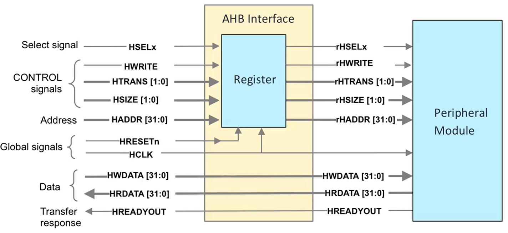
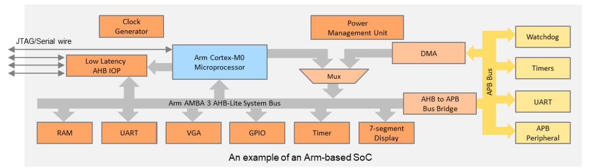
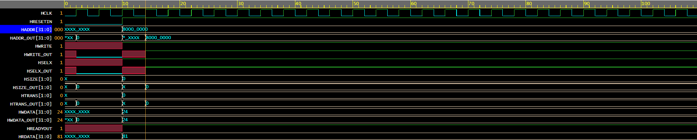

# AHB-Lite Designs

## Introduction
These modules have been developed for ARM Cortex M0 Processor. This processor works on the AMBA3 AHB-Lite Protocol. 

## Navigation
1. AHB Interface Unit 

## Images
1. AHB Interface Unit

2. AHB-Lite Interface

3. Timing Diagram

